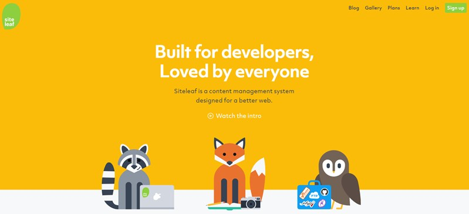

# Create Pages

If you have followed along so far, you have a good looking website with sample content.
But there is no fun there - let's kick start making the website our own with pages.

Pages in a Blog refer to content that is static - does not change over weeks, months or years. The sample content already has a 'About Me' page - we need to edit that.

You **can** do the editing of the page in GitHub just like before. You go to your repository (e.g. https://github.com/somethingawesome123?tab=repositories), select the file, select pencil icon, edit content, and save.

If you have not noticed, the editor in GitHub is not quite made for content editing. Fortunately, there are few options to make your life easier.

## 1. SiteLeaf

[SiteLeaf](https://siteleaf.com) makes it easy to write content to any static website - just like the site we are building using Jekyll.

Go to [SiteLeaf signup page](https://manage.siteleaf.com/signup). Click on 'Signup with GitHub' button, and approve GitHub to share login information with SiteLeaf.

Now, do not go and create a new website again (or, do that later). You need to connect the current repository that you were editing so far.

SiteLeaf asks for the exact repository that it needs to connect to. Just click on the box, select the right option, and you are good to go. Once signed in, you will land bang on your pages.

Select the existing __Aboutme__ page, and you can edit away to glory. Note the features to preview, write on a more powerful editor, and ability to select elements from a toolbar rather than typing in Markdown.

Let us now add a new page called "PrivacyPolicy". Create privacy policy to your website from a free generator - e.g. https://privacypolicies.com.
Once you fill up all required information, you will end up with a policy page formatted in HTML. No worries, use another free set of tools to convert HTML to Markdown - e.g. https://domchristie.github.io/turndown/.

Copy the Markdown content, paste in the new Page in SiteLeaf and click on __Save__ button to save your work. Make note of the page name.

You have created a new page, and you need to create a link on the website that points to the page.

1. Go to SiteLeaf __Settings__ | make sure you are on __General__ tab.
2. Scroll down to __navbar-links__
3. Click on __New key/value pair__. Enter a text for the link and point to the new page your just created

Save your work by clicking on __Save__ button at the top-right corner of the window. Remember that you need to wait for a couple of minutes for GitHub to compile changes and refresh your site.

While you are on the Settings page, have a look at all the other options available. 

## 2. Forestry

Did not like SiteLeaf? How about a forest instead? [ #joke-fall-flat ]

[Forestry](https://app.forestry.io) is another awesome service having a free tier to help you add/edit content.

As you did earlier, use GitHub id to logon to Forestry.

Click 'Add Site', follow along the instructions, authorize GitHub to accept connections from Forestry, and import the site. 

You can now work on your pages through Forestry. 

## Other Ways to Work on your Content

There are a number of other applications that connect to your GitHub Jekyll site and provide all the goodness of a powerful editor. Try a couple of them, and stick to the tool for sometime to become familiar with the flow.

My personal workflow is to create a folder on my computer, use [VS Code](https://code.visualstudio.com/) to edit files(which can be done when I am not connected to Internet as well) and push the pages/content to my GitHub repository. Not the easiest workflow, but works well for me. I am sure you will get to your "natural frequency" of working with your website quickly enough.

In all these cases, you will be using Markdown to create/edit content. I took around 60 minutes to get the hang of Markdown basics, and I am not an intelligent person with high IQ. I am sure you will do a better job.

Markdown enables you to -
1. Type away without worrying about formatting - you are assured of standard formatting
2. Easier creation of content. No worries about using the mouse every other word to make it bold. All you need to do is a double star (**bold**)
3. For quick tips on Markdown, head over to http://www.markdowntutorial.com/ and https://guides.github.com/features/mastering-markdown/ 

## Homework: Create a 'Books I Read' Page

Now that you are awesome in creating new pages, may I kindly suggest to add a 'Books I Read' page. Just like before, create the page, fill the content, and add the link to the page in the navbar.

---