# Create your Website
Did you complete the setup? Good! Now to select how your website will look.

## Select Theme
Jekyll themes enable you to copy over ready-made designs for your own site. Jekyll has been there for quite sometime, and it is common to see working themes that are 3-5 years old as well as those created in the past 3 months!

Select a theme for your website to get quickly started. Brace yourself for a few of my recommendations for Blogs, Websites and personal pages are below. Feel free to skip this section if you have chosen a theme, or want to move faster.

## Themes for your Blog

### Beautiful Jekyll
A simple, clean Jekyll theme that showcases your written content. Great for bloggers and writers.

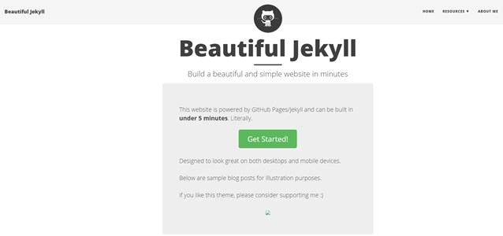

[Demo](https://deanattali.com/beautiful-jekyll/) ; [GitHub](https://github.com/daattali/beautiful-jekyll)

### Tale
Tale enables you to tell a story. A clean, minimalistic theme for bloggers and authors!

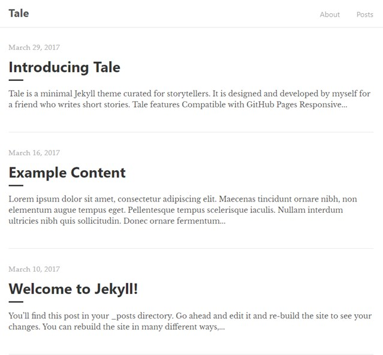

[Demo](https://chesterhow.github.io/tale/) ; [GitHub](https://github.com/chesterhow/tale)

### Jasper 2
A good looking theme that has been carried over from Ghost platform. Features clean layouts and typography.

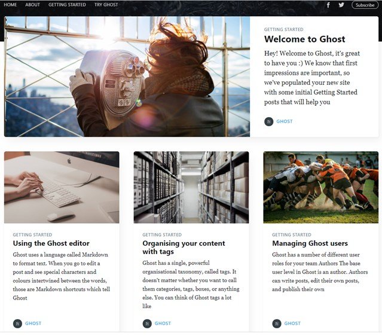

[Demo](https://jekyller.github.io/jasper2/) ; [GitHub](https://github.com/myJekyll/jasper2)

### Mediumish

A great looking theme that looks (a bit?) like [Medium](https://medium.com). I absolutely know that you needed that tagline since the name itself was not sufficient.
[!theme-medium](resources/images/theme-mediumish.jpg)

[Demo](https://wowthemesnet.github.io/mediumish-theme-jekyll/) ; [GitHub](https://github.com/wowthemesnet/mediumish-theme-jekyll/)

### Affiliates
A somewhat traditional theme that provides a familiar picture of your blog.

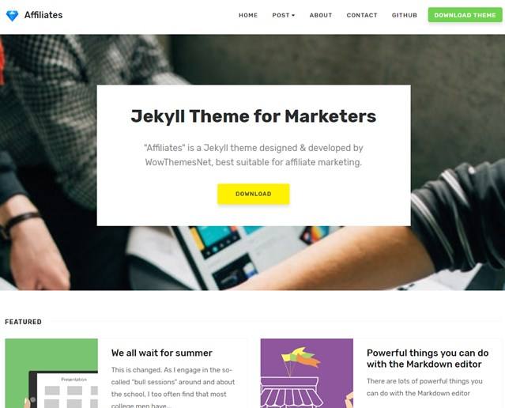

[Demo](https://wowthemesnet.github.io/affiliates-jekyll-theme/) ; [GitHub](https://github.com/wowthemesnet/affiliates-jekyll-theme)

### Mickey
A clean looking theme that showcases both images and content. Clean typography. (a fan of serif here :))

[Demo](http://vincentchan.github.io/mickey) ; [GitHub](https://github.com/vincentchan/mickey)

### Long Haul
Clean, modern theme for today's bloggers.

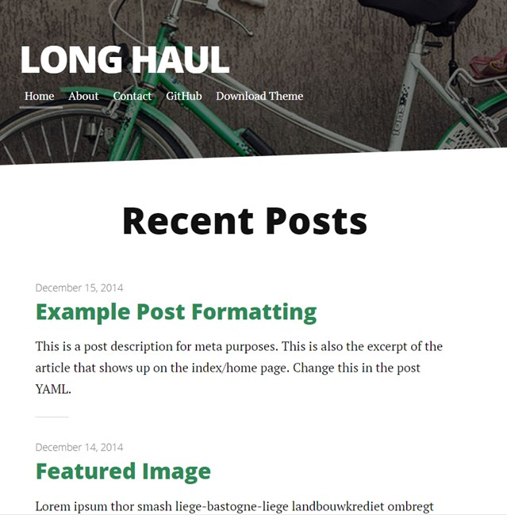

[Demo](http://brianmaierjr.com/long-haul/) ; [GitHub](resources/images/theme-long-haul.jpg)

### Bef
A great looking theme for photographers and travel bloggers.

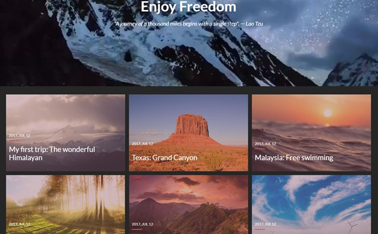

[Demo](http://artemsheludko.com/bef/) ; [GitHub](https://github.com/artemsheludko/bef)

### Websites
Do you need websites that showcase your service or product? Jekyll has you covered.

### Jeky New Age
A good theme to showcase your products or services, and blogs! Built by StartBootstrap, a group known for their quality work.

[Demo](https://jekynewage.github.io/) ; [GitHub](https://github.com/jekynewage/jekynewage.github.io)

### Helium
Helium is a comprehensive theme to get you hit the ground running.

[Demo](https://heliumjk.github.io/) ; [GitHub](https://github.com/heliumjk/heliumjk.github.io)

### Agency
Big, bold font and images - get your message across (or shout it out if not heard).

[Demo](https://blackrockdigital.github.io/startbootstrap-agency/) ; [GitHub](https://github.com/BlackrockDigital/startbootstrap-agency)

## Portfolio Themes
Create portfolio sites to showcase your work using these themes.

### Freelancer
Big. Bold. Enough said.

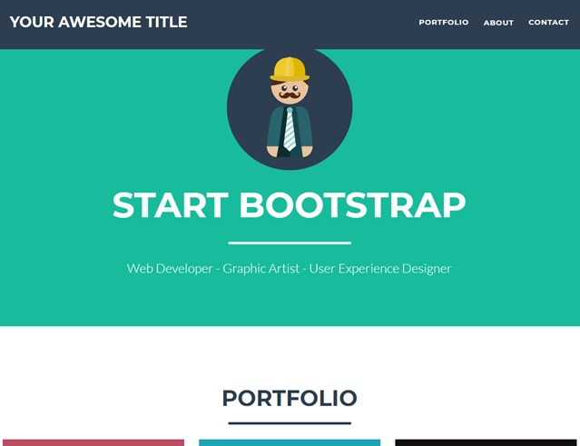

[Demo](http://jeromelachaud.github.io/freelancer-theme/) ; [GitHub](https://github.com/jeromelachaud/freelancer-theme)

### Phantom

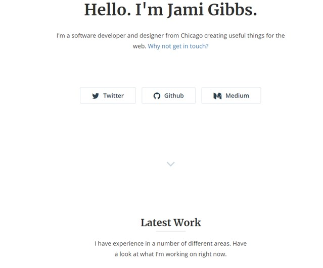

[Demo](http://jamigibbs.github.io/phantom/) ; [GitHub](https://github.com/jamigibbs/phantom)

## More
You can choose many more themes from -
 - [http://themes.jekyllrc.org/]
 - [http://jekyllthemes.org/]
 - [https://jekyllthemes.io/]: has both free and paid themes
 - [https://drjekyllthemes.github.io/]
 - [https://themeforest.net/category/static-site-generators/jekyll]: paid themes

Don't get overwhelmed - many themes are repeated across the sites. But, do consider the below -
 - Not all themes are supported to be hosted on GitHub. Refer the theme documentation and contact author if in doubt. You may not be able to just copy over the theme repository to your GitHub account, but would need a few additional steps. Refer to the instructions from the theme author.
 - Not all plugins are supported on GitHub. So, you may need to keep any eye out for that as well

Before you ask - yes, we are coming to the most important question of this chapter. You are totally right to guess about the presence of Hyde to the Jekyll. No, it is not evil but *is* old (hence the honourable mention). Check out the [demo](http://hyde.getpoole.com/), or the source on [GitHub](https://github.com/poole/hyde).

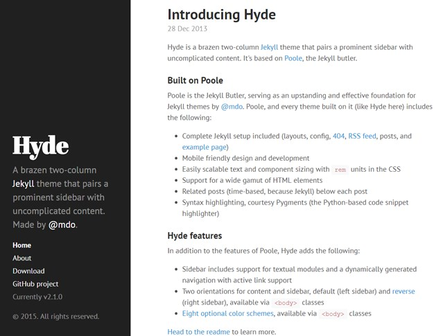

For the purpose of this book, I will consider 'Beautiful Jekyll' as the selected theme. 
 - Theme is beautiful to look at
 - Clean design
 - Responsive (for the most part !)
 - Focuses on content
 - Has Discus commenting built in (no need to install anything)
 - Can be hosted on GiHub

The procedures given below to setup the site will apply to other themes as well. Refer the documentation of the theme to know more on the features offered in the theme.

## Copy Selected Theme and Start Site
Logon to GitHub with your own id and password if you have not already done so. Now, head over to the theme home page on GitHub (why did you think I pointed to GitHub for each theme outlined above!?).

In my case, I go to [beautiful GitHub here](https://github.com/daattali/beautiful-jekyll).

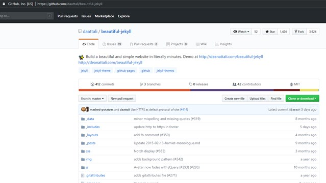

Click on __Fork__ button at the top right hand corner of GitHub page. That will copy over the repository to your own GitHub account.

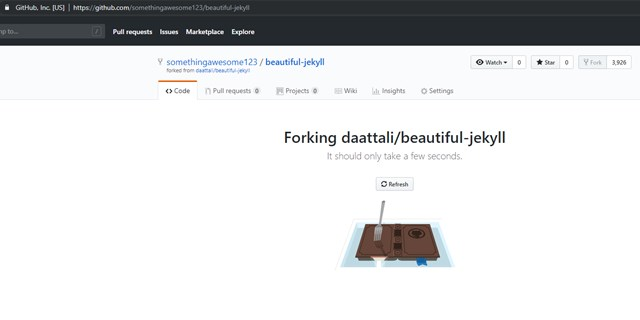

Now, rename the repository. Go to __Settings__, and name repository as '<GitHub_user_name>.github.io'.

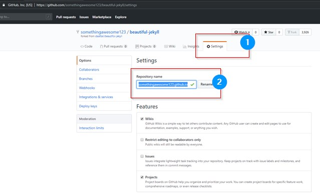

I created a GitHub user called 'somethingawesome123', since I wanted the site at 'somethingawesome123.github.io'. All I am doing now is to rename the theme folder to tell GitHub that I will be storing the site content in this repository.

Click on the ___config.yml__ file in your repository list of files. Click on the 'pencil' icon at the right to edit the file.

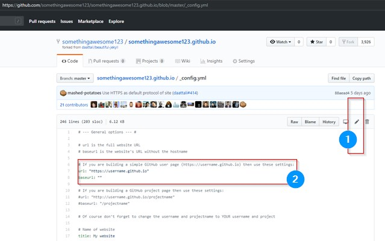

Change the following parameters and values -

| Source Value                             | Change To                                |
|------------------------------------------|------------------------------------------|
| url: "https://username.github.io"        | url: https://somethingawesome123.github.io *Use actual username given in the URL* |
| title: My website                        | title: Awesomeness Overloaded            |
| name: Some Person                        | name: Dr. Jekyll *Preferably your name*  |

Scroll all the way down, and click on __Commit changes__ green button. You will get back to the read only view of the file.

Meditate for a couple of minutes. 

Visit your site at __user_name.github.io__. In my case it is [http://somethingawesome123.github.io]. Voila - your site is ready.

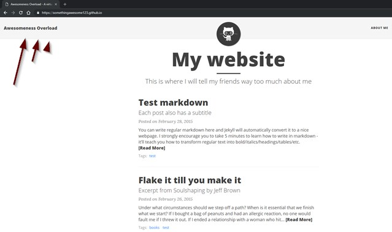

Want to know what happened here?
 - you changed a file telling GitHub that the site needs to be compiled
 - GitHub saw your user name something123 and the repository at somethingawesome123.github.io. It compiled the content automatically to host the site at somethingawesome123.github.io

Don't go the party yet. We can change a few things to make the website complete.

## Give Finishing Touches to Your Website
We will do rest of the changes iteratively. For the most part: you can do a single change, save the change on GitHub, and go back to your website in a minute to see how the changes behave.

### Miscellaneous Changes to _config.yml
Remember the values we changed a few lines back? Well, that was just the beginning. The comments in ___config.yml__ file is self evident. Follow the same method as earlier to change a few more values (provided below in top-down order).

Find for the string mentioned before the ':' below, and replace the string/values with your own.

 - description: I am awesome!
 - Resources: *remove the entire Resources section for now*
 - social-network-links: *update links to your Facebook, Twitter & other social media accounts. Add a '#' at the beginning to comment the line - this will hide the social media account link*
 - share-links-active: *update true or false!*
 - url-pretty: somethingawesome123.github.io
 - gtag: *uncomment by removing the '#' at the beginning of the line. You can enter your Google Analytics tag id here. Don't know what that is? Just skip this for now! 
 - disqus: *create your id/site on disqus.com. Enter the disqus short name of the site here. This will enable Disqus comments for your site.*

You can let everything else be.

### Change Avatar
Go back to your file list at the 'root' or 'home' folder. For me this is [https://github.com/somethingawesome123/somethingawesome123.github.io/]. (I will call this root or home hereon).

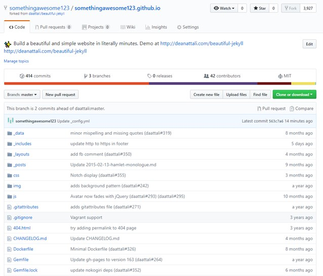

Go to __img__ folder. Click on __avatar-icon.png__ to see the image, then right click and select __Save image as__ and download the image to your computer. Take note of the size of the image (512px in my case). You can use a free program like [paint.net](https://www.getpaint.net/) to do that. Replace the original image with your own image that is similar in size.

You will be in the same __img__ folder on GitHub. Click on __Upload files__ button. Upload your own avatar image, and click on 'Commit changes' green button. This will upload the new avatar.

### Change Home Page Content
Go to root folder on GitHub. Drilldown on __index.html__. Click on pencil icon to edit file. 
Change following -
 - title: Awesomeness Overloaded Indeed
 - *remove or comment out subtitle*

Click on __Commit changes__ green button to save your changes back to GitHub. 
Going further, just follow the above instructions when you have to "edit any file".

### Change About Me page
Edit aboutme.md file. Retain the header section at the top - feel free to remove/change any other content.

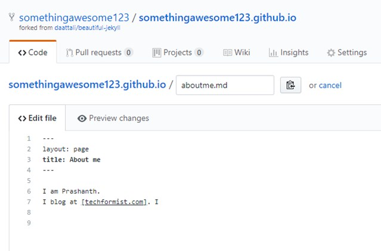

### Change/Add/Remove Posts
Go to GitHub root folder > ___posts__ folder.
Click on any post and observe the format. Change content (again, leave he header alone), or remove the post altogether. To remove any file, click on the file, click 'Delete' icon in the screen, and click 'Commit changes' green button.

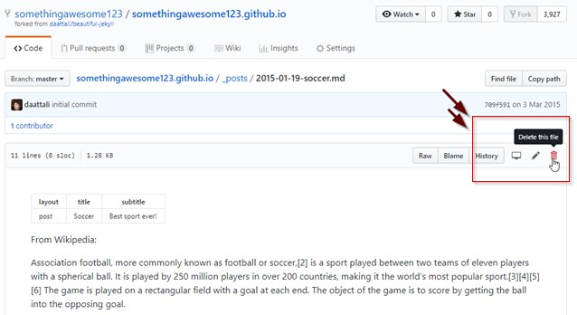

### Change README.md
Go to root folder on GitHub and edit __README.md__. You can remove everything in the file, add your own content and save it. You can add anything here - this readme is for your own use and the content will not be displayed on the website.

## End Result
After all the changes, you should now have a clean home page with your changes.

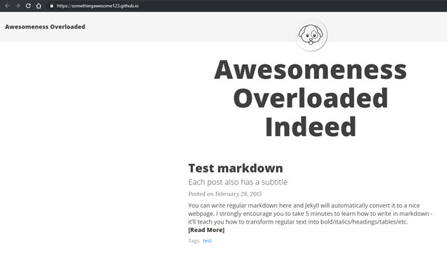

