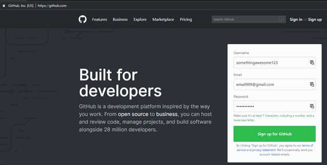

# Setup Everything
We will quickly go through setting up of things required for Jekyll.

## Create GitHub Account
Head over to [GitHub](https://github.com/). 

Fill up three fields, and hit sign up.

 - __Username:__ preferably, choose the user name same as the website name. For example: if you want your website to be at "https://techformist.github.io", you want to create the account as "techformist". This is important if you are going to have a website address like "techformist.github.io". If you don't mind getting your own domain, you can fancy any name here.
 - __Email:__ your email
 - __Password:__ password123

(Did you fall for the password thing? Setup a complex password that only you can remember!)

Hit sign up. 

In the next screen choose the __Free__ plan. Click on __Continue__, and click again on __Submit__ button in the next screen.
You will need to verify yourself by clicking a link in the email that GitHub sends you. And, you are all set.

### Why do this?
GitHub is a popular site to maintain "versions" (= copies or revisions) of programs or documents, and is used by millions of developers around the world. We will use it to store all our website content. 

__Is using GitHub safe?__ 
Absolutely. You are in good hands.

__Is this better than *abra_ka_dabra* (put your hosting provider here)?__
If you have used cheap hosting before - yes. It is comparable, and probably better than the other platforms like Wordpress.com or Blogger.

__Isn't all my information available to everyone?__
Yep. GitHub provides an excellent way to host your content subject to the terms that the content is available to everyone. You were exposing the content on the website anyway, GitHub provides one more rather unfriendly way to get to the same content.

Do take note though - others can see your website, copy it and make modifications. While your website remains the same, they can host a website that looks similar to yours. This is akin to using Wordpress themes, but goes deeper.

You will be using resources to "legally copy" website themes yourself, and hopefully, you will see similar satisfaction in others copying your website design.

You can "hide" your underlying site in three major ways-

 - Create content in some other private folder (e.g. BitBucket, a service similar to GitHub) and use services like [Netlify](https://netlify.com) to generate your websites
 - Install a development environment on your local computer. Generate content yourself, and get GitHub to host the generate content
 - Pay for [GitHub Developer account](https://github.com/pricing) ($7/mo - free for students). Make your content private and expose it only through your website!

We will go over the first two options in brief, but I recommend you to continue through this book by using a 'public repository' (= folder) on GitHub.

## Domain (Optional)
If you don't mind spending $1 to ~$10 per year, you can get any GitHub account and get started. The name in GitHub does not matter because you will point your chosen domain name to the GitHub repository.

I recommend [Name Silo](http://bit.ly/get-good-domains)(aff) to buy domains since they are priced well (= cheap), and provide decent support.

---